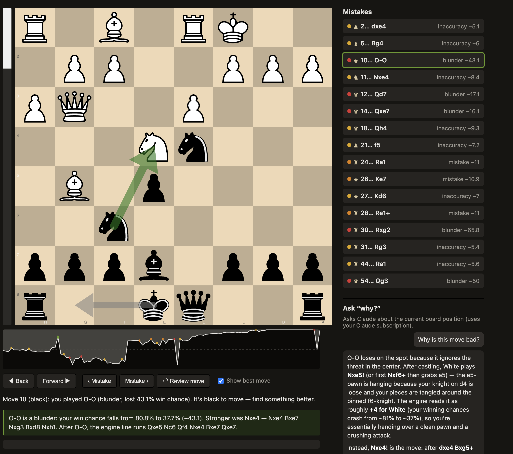

# Chess Review MCP

Analyze a chess game (PGN) with **Stockfish**, find where you went wrong, and, unlike a bare
engine, get the mistakes **explained in words**, grounded in real engine lines. It runs two ways:
from the **Claude Code terminal** (as an MCP server) and as an **interactive web board** (a
Lichess-style review UI) that share one engine and one analysis, so they never disagree.

<!-- TODO: hero screenshot.
     Capture the full web board for a reviewed game: board on the left with a mistake selected
     (gray "played" arrow + green best-move arrows + red refutation arrow), the eval bar, the
     win graph underneath, and the right sidebar showing the mistake list + the "Ask why?" chat
     with one answered question. Save as docs/screenshots/hero.png -->


---

## Features

- **Full-game review** → an ordered list of your inaccuracies / mistakes / blunders with per-side
  accuracy, using Lichess-style win%-drop thresholds (5 / 10 / 15).
- **Explanations in words.** Every flagged move gets a concrete, engine-grounded comment (the
  better move, its line, and how your move gets punished). No guessing: it's built from the engine
  sweep.
- **Interactive board** (chessground): replay each mistake, try your own moves, free-explore down
  any line.
- **Eval bar + Lichess-style win graph** that orient to the side you're reviewing (black-on-bottom
  when you played black). Click the graph or use ← / → to scrub the whole game.
- **Move arrows:** gray = the move you played, green = engine best moves (live **multi-PV** with
  **progressive deepening**, thicker arrow = better move), red = the refutation of a move you try.
- **In-browser "why? / what now?" chat** powered by headless `claude -p` (your Claude
  subscription), fed pre-computed engine facts so answers are grounded, not estimated.
- **Cross-game history + coaching profile.** Every reviewed game is saved locally, tagged with
  recurring mistake motifs (hung pieces, missed forks, back-rank, time trouble…), and rolled up
  into a per-player profile. Toggle **"Personalize with my history"** in the chat and Claude can
  draw on your recurring patterns — only when they actually bear on the position in front of you.

<!-- TODO: screenshot of the mistake list + the engine-grounded comment box.
     Show the right-sidebar "Mistakes" list and, below the board, the green comment box for a
     selected blunder (e.g. "Nf3 is a blunder: your win chance falls from 80.8% to 56.9% ...").
     Save as docs/screenshots/mistakes-and-comment.png -->
<!--  -->

---

## How it works

One Python process holds one Stockfish engine pool and one in-memory review session. The MCP server
(for Claude Code) and the FastAPI web server run in that **same process** and share the session, so
the terminal and the board are always looking at the same analysis.

<p align="center">
  
</p>

The browser's "why?" chat is the only part that reaches outside the process: the FastAPI backend
shells out to headless `claude -p` (your subscription). 

---

## Installation

### Prerequisites

- **Python 3.11+**
- **Stockfish** engine (any recent version; v16+ recommended). Install it separately, since it is
  not a pip package.
  - macOS: `brew install stockfish`
  - Debian/Ubuntu: `sudo apt install stockfish`
  - Or download from <https://stockfishchess.org/download/> and note the binary path.
- **Internet connection** for the web board's first load (chessground / chess.js are pulled from a
  CDN, so there's no Node/npm build step).
- *(Optional, only for the in-browser chat)* the **`claude` CLI** (Claude Code) installed and logged
  in (`claude login`). The terminal workflow needs Claude Code too.

### Set up the Python environment

```bash
# from the repo root
python3.11 -m venv .venv && source .venv/bin/activate     # or use conda
pip install -r requirements.txt
```

### Point the tool at your Stockfish

The code reads `STOCKFISH_PATH` (default: `stockfish` on your `PATH`). Find your binary with
`which stockfish` and export it, e.g.:

```bash
export STOCKFISH_PATH=/usr/local/bin/stockfish
```

### (For the Claude Code / MCP workflow) edit `.mcp.json`

`.mcp.json` registers the server as **`chess`**. Update the `command` to **your** Python
interpreter and set the env for your machine:

```json
{
  "mcpServers": {
    "chess": {
      "command": "/absolute/path/to/.venv/bin/python",
      "args": ["-m", "server.mcp_server"],
      "env": {
        "STOCKFISH_PATH": "/usr/local/bin/stockfish",
        "CHESS_USERNAME": "your-lichess-or-chesscom-username"
      }
    }
  }
}
```

`CHESS_USERNAME` lets `analyze_game(player="auto")` figure out which side is "you" from the PGN
headers.

---

## Usage

### Option A: the web board (no Claude Code required)

The quickest way to review a game. Pass a PGN file and which color you played:

```bash
STOCKFISH_PATH=/usr/local/bin/stockfish \
  python scripts/run_web.py example_pgns/game1.pgn white
```

It analyzes the game (~20 to 45s depending on length), opens your browser to
`http://127.0.0.1:8765`, and you can:

1. Click a mistake in the sidebar → the board jumps to that position (gray arrow = the move you
   played) and a written explanation appears.
2. Drag a piece to try a better move → eval bar + a verdict update; a red arrow shows the
   refutation if it's bad.
3. Toggle **Show best move** to see the engine's top move(s) as green arrows that sharpen as the
   search deepens.
4. Scrub the whole game with ← / → or by clicking the win graph; **Back** undoes one ply when
   you're exploring a line.
5. Ask **"why is this bad?"** or **"what should I do here?"** in the chat panel.

The third argument is your color: `white`, `black`, or `auto` (infer from the PGN headers).

<!-- TODO: screenshot of the best-move arrows.
     Toggle "Show best move" on a quiet middlegame position so two green arrows show, one bold
     (best) and one thin (a slightly worse alternative). Save as docs/screenshots/best-move-arrows.png -->
<!--  -->

<!-- TODO: screenshot of the win graph.
     Capture the graph strip under the board across a full game, showing the two-tone fill,
     colored dots at the mistakes, and the vertical current-move marker. Save as
     docs/screenshots/win-graph.png -->
<!--  -->

### Option B: from the Claude Code terminal (MCP)

With the server registered in `.mcp.json`, open Claude Code in this directory (reload so it picks
up the `chess` server), then:

1. Paste a PGN and say *"analyze this game"* → Claude calls `mcp__chess__analyze_game`, narrates the
   mistakes, and gives you the board URL.
2. Ask *"why was move 4 bad?"* → Claude calls `mcp__chess__get_engine_line` and explains using the
   returned best line + refutation.

Tools exposed: `mcp__chess__analyze_game`, `mcp__chess__get_engine_line`, `mcp__chess__goto_mistake`,
`mcp__chess__get_player_profile` (your cross-game coaching profile, see below).

#### Example (terminal)

> **You:** *(paste PGN)* analyze this as white
>
> **Claude:** Your accuracy: 92.7%, a clean game. 3 flagged moments…
> 1. **Move 4: Nf3** was the big one. After 3…Nd4?? the crushing reply was **4. c3!**, kicking the
>    knight with nowhere to go (~+3.7). Instead 4. Nf3 invited 4…Nxf3+ and dropped to roughly equal.
> 2. **Move 10: Qf3** (a mistake, but you were already winning)…
>
> 📊 Open the interactive board: http://127.0.0.1:8765

### In-browser chat

The chat panel answers position-aware questions using your Claude subscription. Each question is
handed the **current board** (for *"what should I do here?"*) and the **move in question** (for
*"why is this bad?"*), each with pre-computed Stockfish facts, so Claude reasons from real lines.
Follow-up questions remember the conversation.

<!-- TODO: screenshot of the chat panel with a Q&A.
     Show "Why is Nd4 bad here?" and Claude's grounded answer rendered with bold/lists. Save as
     docs/screenshots/chat.png -->
<!--  -->

<!-- > **Note on billing:** in-browser chat uses your subscription's separate **Agent SDK credit** (not
> per-token API billing). If it's exhausted, you'll get a friendly message, so just ask in the
> Claude Code terminal instead, which uses your normal interactive limits. -->

---

## Game history & coaching profile

Every game you review is **saved locally** so the tool can learn your recurring weaknesses over
time. This is best-effort and fully local: history can never break a review, and nothing leaves
your machine (the chat is the only outbound call, and your profile is only attached to it when you
opt in).

- **What's saved.** `analyze_game` appends one compact JSON record per reviewed game to
  `<DATA_DIR>/history/games.jsonl` (`DATA_DIR` defaults to `<repo>/.chess-review`, which is
  gitignored). Re-analyzing the same game — even at a deeper depth — supersedes the old record
  rather than duplicating it.
- **Mistake motifs.** Each flagged mistake is tagged with cheap, engine-free heuristics in three
  buckets: things you *did* (e.g. `hung_piece`, `pawn_grab`), things you *missed* (`missed_fork`,
  `missed_mate`, `missed_capture`), and things you *allowed* (`allowed_fork`, `allowed_mate`,
  `back_rank`), plus `time_trouble` when your clock was low (read from `[%clk]` PGN comments).
- **Coaching profile.** Records roll up into a **hybrid** profile: a `recent` sliding window (so
  weaknesses you've fixed fade out) plus a `lifetime` view, with an "improving / slipping" trend.
  Get it from the terminal with `mcp__chess__get_player_profile`, or let the board's chat use it.
- **Personalized chat.** The chat panel's **"Personalize with my history"** toggle attaches the
  profile to your question so Claude can connect the position to your recurring patterns. It's
  designed to stay subtle — Claude only brings up your history when it genuinely sharpens the
  answer, not in every reply.

### Who is "you"? (identity & aliases)

History is keyed to a canonical player, not a username, so games across your Lichess and Chess.com
accounts merge into one profile. Set `CHESS_USERNAME` to your main handle and list any other handles
in `CHESS_ALIASES` (comma-separated, e.g. `"dpdemler, my_other_lichess"`); they all fold into one
player and also drive `player="auto"` side detection. For multiple people sharing the install, a
hand-maintained `<DATA_DIR>/identities.json` alias map takes precedence.

To turn history off entirely, set `CHESS_HISTORY=0`.

---

## Configuration

All via environment variables (sensible defaults shown):

| Variable | Default | Purpose |
| --- | --- | --- |
| `STOCKFISH_PATH` | `stockfish` | Path to the Stockfish binary. |
| `CHESS_USERNAME` | `JohnDoe` | Used by `player="auto"` to pick your side from PGN headers. |
| `CHESS_DEFAULT_DEPTH` | `18` | Depth for on-demand single-position analysis. |
| `CHESS_SWEEP_DEPTH` | `16` | Depth for the full-game sweep (keeps long games fast). |
| `CHESS_ENGINE_POOL_SIZE` | `2` | Reused Stockfish processes. |
| `CHESS_WEB_HOST` / `CHESS_WEB_PORT` | `127.0.0.1` / `8765` | Web board address. |
| `CHESS_WEB_AUTOSTART` | `1` | Set `0` to stop the MCP server from launching the board. |
| `CHESS_ALIASES` | *(empty)* | Your other handles (comma-separated) that fold into `CHESS_USERNAME` for history + auto side-detection. |
| `CHESS_HISTORY` | `1` | Set `0` to disable saving game history & the coaching profile. |
| `CHESS_DATA_DIR` | `<repo>/.chess-review` | Where history (`games.jsonl`, profile, `identities.json`) is stored. |
| `CHESS_PROFILE_RECENT` | `25` | Games in the profile's `recent` sliding window. |
| `CHESS_PROFILE_LIFETIME` | `all` | Lifetime view span; positive N = last N games, `0` = omit it (pure sliding window). |
| `CHESS_SESSION_TTL` | `86400` | Seconds of inactivity before the server self-terminates (`0` disables the watchdog). |

---

## Running the tests

```bash
STOCKFISH_PATH=/usr/local/bin/stockfish python -m pytest
```

Pure-math tests are instant; engine tests use a low depth (~1s total). The chat test is mocked, so
the suite never spends Agent-SDK credit.

---

## Project layout

```
server/
  config.py          # all tunables (env-driven)
  core/              # engine pool, evaluation math, game analysis, session, engine_line,
                     #   history (game records + motifs + coaching profile), lifecycle watchdog
  mcp_server.py      # MCP tools; boots the web server in a background thread
  claude_bridge.py   # headless `claude -p` for the chat (subscription)
  web/               # FastAPI app + board/chat routes + uvicorn runner
frontend/            # no-build single page (index.html + main.js + styles.css, CDN chessground)
scripts/             # run_web.py (standalone board), validation/smoke scripts
example_pgns/        # sample games (game1.pgn White, game2.pgn Black)
tests/               # pytest suite
```

---

## Limitations / notes

- The web board pulls chessground & chess.js from a CDN at runtime (no build step), so it needs
  internet on first load.
- In-browser chat requires the `claude` CLI installed and logged in, and draws from your Agent SDK
  credit; the terminal path is the zero-extra-cost fallback.
- Engine analysis is fixed-depth and cached for reproducibility, so evals can differ slightly from
  Lichess near classification boundaries. That's expected.
