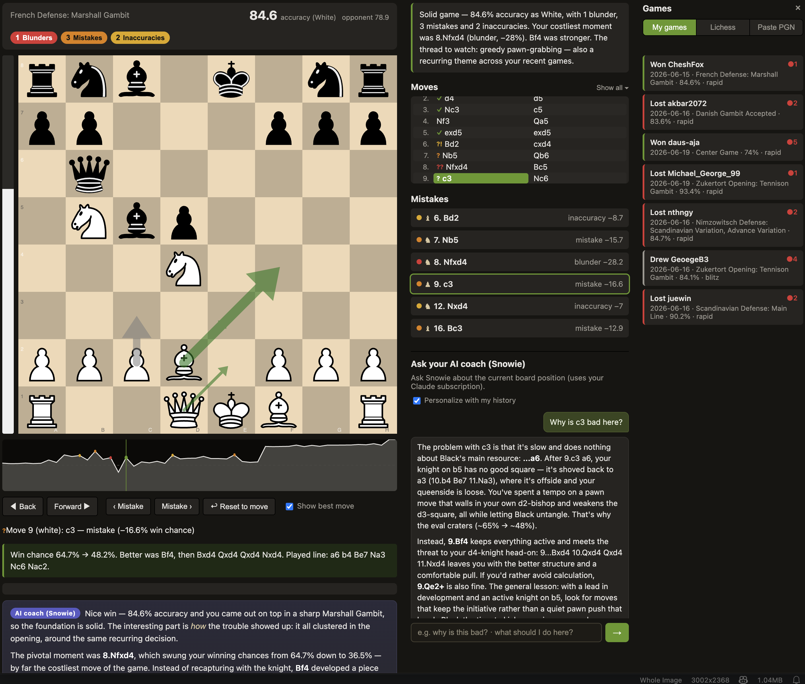
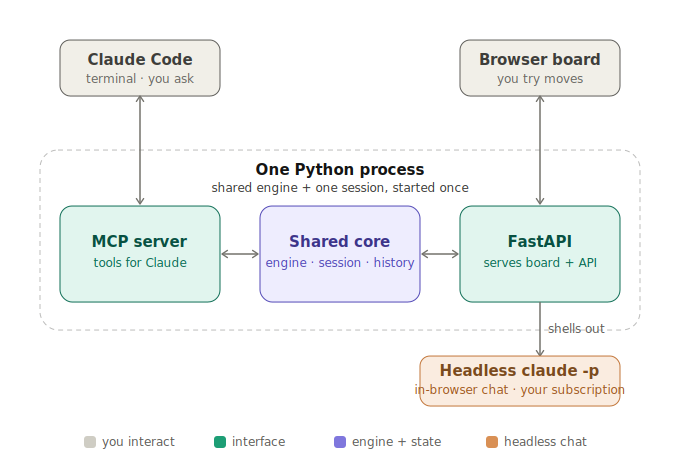

# Chess Review MCP

Analyze a chess game (PGN) with **Stockfish**, find where you went wrong, and, unlike a bare
engine, get the mistakes **explained in words**, grounded in real engine lines. It runs two ways:
from the **Claude Code terminal** (as an MCP server) and as an **interactive web board** (a
Lichess-style review UI) that share one engine and one analysis, so they never disagree.



---

## Features

- **Full-game review** → an ordered list of your inaccuracies / mistakes / blunders with per-side
  accuracy, using Lichess-style win%-drop thresholds (5 / 10 / 15).
- **Explanations in words.** Every flagged move gets a concrete, engine-grounded comment (the
  better move, its line, and how your move gets punished). No guessing: it's built from the engine
  sweep.
- **Interactive board** (chessground): replay each mistake, try your own moves, free-explore down
  any line.
- **Eval bar + Lichess-style win graph** that orient to the side you're reviewing (black-on-bottom
  when you played black). Click the graph or use ← / → to scrub the whole game.
- **Move arrows:** gray = the move you played, green = engine best moves (live **multi-PV** with
  **progressive deepening**, thicker arrow = better move), red = the refutation of a move you try.
- **In-browser AI coach (Snowie).** A "why? / what now?" chat powered by headless `claude -p`
  (your Claude subscription), fed pre-computed engine facts so answers are grounded, not estimated.
- **Cross-game history + coaching profile.** Every reviewed game is saved locally, tagged with
  recurring mistake motifs (hung pieces, missed forks, back-rank, time trouble…), and rolled up
  into a per-player profile. Toggle **"Personalize with my history"** in the chat and Claude can
  draw on your recurring patterns — only when they actually bear on the position in front of you.

<!-- TODO: screenshot of the mistake list + the engine-grounded comment box.
     Show the right-sidebar "Mistakes" list and, below the board, the green comment box for a
     selected blunder (e.g. "Nf3 is a blunder: your win chance falls from 80.8% to 56.9% ...").
     Save as docs/screenshots/mistakes-and-comment.png -->
<!--  -->

---

## How it works

One Python process holds one Stockfish engine pool and one in-memory review session. The MCP server
(for Claude Code) and the FastAPI web server run in that **same process** and share the session, so
the terminal and the board are always looking at the same analysis.

<p align="center">
  
</p>

The browser's "why?" chat is the only part that reaches outside the process: the FastAPI backend
shells out to headless `claude -p` (your subscription). 

---

## Installation

### Quick install (recommended)

One command sets up everything — it installs [uv](https://docs.astral.sh/uv/) (which downloads a
compatible Python for you, so your own Python version doesn't matter), installs Stockfish, builds
the environment, and saves your username. **You do not need Python or any prior setup.**

```bash
# macOS / Linux — from the repo root
./install.sh
```

```powershell
# Windows (PowerShell)
powershell -ExecutionPolicy Bypass -File .\install.ps1
```

The script is safe to re-run (each step is skipped if already done) and finishes with a self-check.
You can run that check any time:

```bash
uv run python -m server.doctor
```

That's it — skip to [Usage](#usage). The MCP server is already registered in `.mcp.json` (no path
editing needed: it runs via `uv`, which is machine-independent); the only thing worth setting is
your username, which the installer prompts for.

### Just want to review your Lichess games? Double-click **Tintins AI Chess Analysis**

If you don't want to touch a terminal at all, use the double-click launcher:

- **macOS / Linux:** double-click **`Tintins AI Chess Analysis.command`**
- **Windows:** double-click **`Tintins AI Chess Analysis.bat`**

The **first launch** installs everything for you (uv + Stockfish + the project env — it just runs
the installer above), then opens the board in your browser with your **most recent Lichess game**
already loaded. Every launch after that skips straight to opening the board.

- **First time only:** macOS may block a double-clicked script — **right-click → Open**, then
  **Open** again. On Windows, if SmartScreen warns, click **More info → Run anyway**.
- **Which account?** It defaults to your configured username (**⚙ Settings → Your username**, or the
  `CHESS_USERNAME` saved at install time). In the board's **Lichess** panel you can look up any handle
  and click **"Set as my account"**; if no username is configured, the app asks for one on first open.
  The choice is saved server-side (in `settings.json`), so it's the same account everywhere.
- **No Lichess account (e.g. Chess.com)?** Use the **Paste PGN** tab in the Games panel — paste any
  PGN, or **Upload .pgn** a Chess.com export of one *or many* games, and click **Analyze**; all the
  games are reviewed into **My games**. The first-run prompt also has a "Paste a PGN instead" shortcut.
- **To quit:** just close the browser tab — the server stops a few seconds later and its terminal
  window closes itself. (You can also close that window directly, or press Ctrl-C in it.)

#### Prefer a real macOS app in /Applications? Build the `.app` bundle

For an Anki-style experience — an icon you drag into **Applications** and double-click, with **no
terminal window at all** — build a native `.app` wrapper:

```bash
./scripts/build_app.sh        # → Tintin's AI Chess Analysis.app (in the repo root)
```

Then drag `Tintin's AI Chess Analysis.app` into **/Applications** and double-click it. Behaviour
is identical to the `.command` launcher (first run installs uv + Stockfish; later runs open straight to
the board; close the tab to quit), with two niceties: it runs as a GUI app (no Terminal window), and
its Python environment + your games/settings live in
`~/Library/Application Support/Tintin AI Chess Analysis/` — **outside** the bundle, so the app stays
immutable and your data survives a rebuild or update.

- **First open:** unsigned, so macOS Gatekeeper needs **right-click → Open → Open** once.
- **Icon:** ships with the site's chess-pawn favicon (`assets/app_icon.png`). To customise, replace
  that file (1024×1024) or drop an `assets/AppIcon.icns`, then rebuild.
- **Setup problems** are shown in a dialog; full logs go to
  `~/Library/Application Support/Tintin AI Chess Analysis/launch.log`.
- It still needs the network on first run (to fetch uv + Python + Stockfish) and the `claude` CLI for
  the in-browser chat — for a fully offline, dependency-free bundle you'd need a PyInstaller build.

### Prerequisites (what the installer handles for you)

- **Stockfish** engine (the installer adds it via `brew` / `apt` / `winget`). The tool auto-detects
  a normal install, so no path configuration is needed. To use a custom build, set `STOCKFISH_PATH`.
- **Internet connection** for the web board's first load (chessground / chess.js come from a CDN, so
  there's no Node/npm build step).
- *(Optional, only for the in-browser chat and the Claude Code terminal workflow)* the **`claude`
  CLI** (Claude Code), installed and logged in (`claude login`). The web board's game review works
  without it.

### Manual setup (if you'd rather not use the script)

You still want **uv** — it removes the Python-version headaches. [Install
uv](https://docs.astral.sh/uv/getting-started/installation/), then:

```bash
uv sync                 # builds the env + fetches a compatible Python
# install Stockfish yourself: macOS `brew install stockfish`,
#   Debian/Ubuntu `sudo apt install stockfish`, or https://stockfishchess.org/download/
uv run python -m server.doctor   # confirm Python + Stockfish are good
```

Then open `.mcp.json` and set `CHESS_USERNAME` to your handle (it's what lets
`analyze_game(player="auto")` figure out which side is "you" from the PGN headers). You shouldn't
need to touch `command`/`args` — they invoke the project through `uv`.

<details>
<summary>Prefer a plain venv / conda instead of uv?</summary>

The project is a standard `pyproject.toml`, so it works in any Python 3.11+ environment:

```bash
python3.11 -m venv .venv && source .venv/bin/activate   # or conda
pip install -r requirements.txt
```

Then in `.mcp.json` set `"command"` to that interpreter's absolute path (e.g.
`/abs/path/.venv/bin/python`) and `"args"` to `["-m", "server.mcp_server"]`, and run scripts with
that interpreter instead of `uv run python`.
</details>

---

## Usage

### Option A: the web board (no Claude Code required)

The quickest way to review a game. Pass a PGN file and which color you played:

```bash
uv run python scripts/run_web.py example_pgns/game1.pgn white
```

It analyzes the game (~20 to 45s depending on length), opens your browser to
`http://127.0.0.1:8765`, and you can:

1. Click a mistake in the sidebar → the board jumps to that position (gray arrow = the move you
   played) and a written explanation appears.
2. Drag a piece to try a better move → eval bar + a verdict update; a red arrow shows the
   refutation if it's bad.
3. Toggle **Show best move** to see the engine's top move(s) as green arrows that sharpen as the
   search deepens.
4. Scrub the whole game with ← / → or by clicking the win graph; **Back** undoes one ply when
   you're exploring a line.
5. Ask **"why is this bad?"** or **"what should I do here?"** in the chat panel.

The third argument is your color: `white`, `black`, or `auto` (infer from the PGN headers).

**Browse & reopen past games (the Games panel).** A collapsible third column (toggle with the **☰
Games** button) lists games you can open in the board. The panel has three tabs: **My games**
(your previously-analyzed local games), **Lichess** (your recent Lichess games, with a lookup box
for any handle), and **Paste PGN** — paste a PGN from anywhere (e.g. **Chess.com → Share → PGN**),
pick which color you played (or leave it on *auto*), and click **Analyze**. Click any game (or
submit a paste) and the board opens **immediately** — you can step through the moves with ← / →
while the engine analysis runs in the background; the eval bar, win graph, mistake list, comments,
and best-move arrows fill in as soon as it finishes.

**Bulk-analyze a Chess.com export (multiple games at once).** Chess.com lets you download many
games as a single PGN file. In the **Paste PGN** tab, hit **Upload .pgn** (or paste the file's
contents) — the app detects all the games, analyzes them one-by-one in the background (showing
"Game *k* of *N*"), and files every one under **My games**. It figures out which handle is *you*
(the player present in all the games) automatically; if it can't, type your username in the
optional box. Once a handle is recognized this way it's remembered, so future games from that
account (Chess.com *or* Lichess) fold into the same history and coaching profile.

<!-- TODO: screenshot of the best-move arrows.
     Toggle "Show best move" on a quiet middlegame position so two green arrows show, one bold
     (best) and one thin (a slightly worse alternative). Save as docs/screenshots/best-move-arrows.png -->
<!--  -->

<!-- TODO: screenshot of the win graph.
     Capture the graph strip under the board across a full game, showing the two-tone fill,
     colored dots at the mistakes, and the vertical current-move marker. Save as
     docs/screenshots/win-graph.png -->
<!--  -->

### Option B: from the Claude Code terminal (MCP)

With the server registered in `.mcp.json`, open Claude Code in this directory (reload so it picks
up the `chess` server), then:

1. Paste a PGN and say *"analyze this game"* → Claude calls `mcp__chess__analyze_game`, narrates the
   mistakes, and gives you the board URL.
2. Ask *"why was move 4 bad?"* → Claude calls `mcp__chess__get_engine_line` and explains using the
   returned best line + refutation.

Tools exposed: `mcp__chess__analyze_game`, `mcp__chess__get_engine_line`, `mcp__chess__goto_mistake`,
`mcp__chess__get_player_profile` (your cross-game coaching profile, see below).

#### Example (terminal)

> **You:** *(paste PGN)* analyze this as white
>
> **Claude:** Your accuracy: 92.7%, a clean game. 3 flagged moments…
> 1. **Move 4: Nf3** was the big one. After 3…Nd4?? the crushing reply was **4. c3!**, kicking the
>    knight with nowhere to go (~+3.7). Instead 4. Nf3 invited 4…Nxf3+ and dropped to roughly equal.
> 2. **Move 10: Qf3** (a mistake, but you were already winning)…
>
> 📊 Open the interactive board: http://127.0.0.1:8765

### Snowie — the in-browser AI coach

**Snowie** is the chat panel: it answers position-aware questions using your Claude subscription.
Each question is handed the **current board** (for *"what should I do here?"*) and the **move in
question** (for *"why is this bad?"*), each with pre-computed Stockfish facts, so Snowie reasons
from real lines. Follow-up questions remember the conversation.

<!-- TODO: screenshot of the chat panel with a Q&A.
     Show "Why is Nd4 bad here?" and Claude's grounded answer rendered with bold/lists. Save as
     docs/screenshots/chat.png -->
<!--  -->

<!-- > **Note on billing:** in-browser chat uses your subscription's separate **Agent SDK credit** (not
> per-token API billing). If it's exhausted, you'll get a friendly message, so just ask in the
> Claude Code terminal instead, which uses your normal interactive limits. -->

---

## Game history & coaching profile

Every game you review is **saved locally** so the tool can learn your recurring weaknesses over
time. This is best-effort and fully local: history can never break a review, and nothing leaves
your machine (the chat is the only outbound call, and your profile is only attached to it when you
opt in).

- **What's saved.** `analyze_game` appends one compact JSON record per reviewed game to
  `<DATA_DIR>/history/games.jsonl`. `DATA_DIR` defaults to a per-user app-data folder (macOS:
  `~/Library/Application Support/Tintin AI Chess Analysis/data`) that both Claude Code **and** the
  double-click app use, so they share one history/cache automatically. Re-analyzing the same game —
  even at a deeper depth — supersedes the old record rather than duplicating it.
- **Mistake motifs.** Each flagged mistake is tagged with cheap, engine-free heuristics in three
  buckets: things you *did* (e.g. `hung_piece`, `pawn_grab`), things you *missed* (`missed_fork`,
  `missed_mate`, `missed_capture`), and things you *allowed* (`allowed_fork`, `allowed_mate`,
  `back_rank`), plus `time_trouble` when your clock was low (read from `[%clk]` PGN comments).
- **Game mode awareness.** Each game is tagged with its time-format — **bullet / blitz / rapid /
  classical / correspondence** (derived from the `TimeControl` header) — because what counts as a
  mistake differs by mode: a blunder in a 1-minute bullet game is far more forgivable than in a
  long classical one. The flagging thresholds **scale by mode** (blitz is the baseline; faster
  modes are more lenient, slower modes stricter — on top of the per-skill scaling), the coaching
  profile breaks your stats down **by mode**, and both the chat and terminal review judge a game
  against its own mode's expectations.
- **Coaching profile.** Records roll up into a **hybrid** profile: a `recent` sliding window (so
  weaknesses you've fixed fade out) plus a `lifetime` view, with an "improving / slipping" trend.
  Get it from the terminal with `mcp__chess__get_player_profile`, or let the board's chat use it.
- **Personalized chat.** The chat panel's **"Personalize with my history"** toggle attaches the
  profile to your question so Claude can connect the position to your recurring patterns. It's
  designed to stay subtle — Claude only brings up your history when it genuinely sharpens the
  answer, not in every reply.

### Who is "you"? (identity & aliases)

History is keyed to a canonical player, not a username, so games across your Lichess and Chess.com
accounts merge into one profile. Set `CHESS_USERNAME` to your main handle and list any other handles
in `CHESS_ALIASES` (comma-separated, e.g. `"dpdemler, my_other_lichess"`); they all fold into one
player and also drive `player="auto"` side detection. For multiple people sharing the install, a
hand-maintained `<DATA_DIR>/identities.json` alias map takes precedence.

To turn history off entirely, set `CHESS_HISTORY=0`.

---

## Configuration

### In-app Settings panel (no file editing)

Click **⚙ Settings** in the board header to change the common options without touching any files —
your **username**, **other accounts** (aliases that fold into one profile), an optional **Lichess
token**, and, under *Advanced*, the profile windows and the **Stockfish path**. Saving writes
`<DATA_DIR>/settings.json` and applies immediately.

**Precedence: `settings.json` (the panel) overrides the environment (`.mcp.json`), which overrides
the built-in defaults.** Both the standalone app *and* the MCP server read `settings.json` at
startup, so a change you make in the app also takes effect for the Claude Code workflow — your
username is unified across both. (You can still set everything via environment variables below;
the panel is just the no-files path. The auto-detected aliases from a bulk Chess.com import live in
`identities.json` and are merged on top.)

### Environment variables

All settable via environment variables too (sensible defaults shown); `settings.json` wins where set:

| Variable | Default | Purpose |
| --- | --- | --- |
| `STOCKFISH_PATH` | *(auto-detected)* | Path to the Stockfish binary. Auto-detected from your `PATH` and common install locations; only set this for a custom build or an unusual location. |
| `CHESS_USERNAME` | `JohnDoe` | Used by `player="auto"` to pick your side from PGN headers. |
| `CHESS_DEFAULT_DEPTH` | `18` | Depth for on-demand single-position analysis. |
| `CHESS_SWEEP_DEPTH` | `16` | Depth for the full-game sweep (keeps long games fast). |
| `CHESS_ENGINE_POOL_SIZE` | `2` | Reused Stockfish processes. |
| `CHESS_WEB_HOST` / `CHESS_WEB_PORT` | `127.0.0.1` / `8765` | Web board address. |
| `CHESS_WEB_AUTOSTART` | `1` | Set `0` to stop the MCP server from launching the board. |
| `CHESS_ALIASES` | *(empty)* | Your other handles (comma-separated) that fold into `CHESS_USERNAME` for history + auto side-detection. |
| `CHESS_HISTORY` | `1` | Set `0` to disable saving game history & the coaching profile. |
| `CHESS_DATA_DIR` | *(per-user app-data dir)* | Where history (`games.jsonl`, profile, `identities.json`) is stored. Defaults to a user-level folder shared by Claude Code and the app (macOS: `~/Library/Application Support/Tintin AI Chess Analysis/data`); set `<repo>/.chess-review` to keep it in the checkout. |
| `CHESS_PROFILE_RECENT` | `100` | Games in the profile's `recent` sliding window. |
| `CHESS_PROFILE_LIFETIME` | `all` | Lifetime view span; positive N = last N games, `0` = omit it (pure sliding window). |
| `CHESS_SESSION_TTL` | `86400` | Seconds of inactivity before the server self-terminates (`0` disables the watchdog). |

---

## Running the tests

```bash
uv sync --extra dev          # pulls in pytest (one time)
uv run python -m pytest
```

Pure-math tests are instant; engine tests use a low depth (~1s total). The chat test is mocked, so
the suite never spends Agent-SDK credit.

---

## Project layout

```
server/
  config.py          # all tunables (env-driven)
  core/              # engine pool, evaluation math, game analysis, session, engine_line,
                     #   history (game records + motifs + coaching profile), lifecycle watchdog
  mcp_server.py      # MCP tools; boots the web server in a background thread
  claude_bridge.py   # headless `claude -p` for the chat (subscription)
  web/               # FastAPI app + board/chat routes + uvicorn runner
frontend/            # no-build single page (index.html + main.js + styles.css, CDN chessground)
scripts/             # run_web.py (standalone board), validation/smoke scripts
example_pgns/        # sample games (game1.pgn White, game2.pgn Black)
tests/               # pytest suite
```

---

## Limitations / notes

- The web board pulls chessground & chess.js from a CDN at runtime (no build step), so it needs
  internet on first load.
- In-browser chat requires the `claude` CLI installed and logged in, and draws from your Agent SDK
  credit; the terminal path is the zero-extra-cost fallback.
- Engine analysis is fixed-depth and cached for reproducibility, so evals can differ slightly from
  Lichess near classification boundaries. That's expected.
